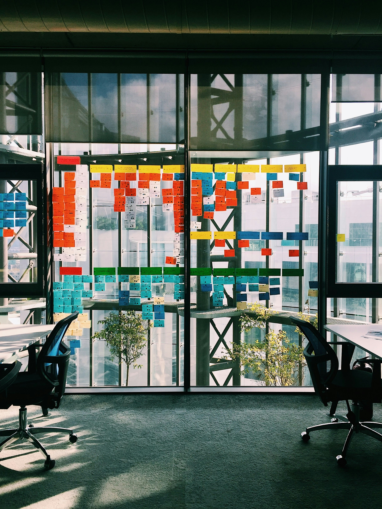

<!--
Why?
 - Show the value of tailoring Retros to your team, while following an outline to achieve what you want
 - Link to design patterns as tools to resolve known problems 

What? 
 - Design Patterns as tool to solve known problems
 - Purpose of retrospective
 - General structure 
 - Some Patterns
 - sample situations - activity 
   - team member tension
   - really successful sprint
-->
 
<!-- _class: invert -->
<!-- _footer: 'Photo by __Lorenzo Herrera__ on __[Unsplash](https://unsplash.com/photos/vintage-gray-game-console-and-joystick-p0j-mE6mGo4)__' -->

# Agile Retrospective 
# Design Patterns
  
---

# About me

**Nico Riedmann**
something @ somewhere

:computer: [riedmann.dev](https://riedmann.dev)

<!-- First a little bit about myself... -->

---

<!-- _class: invert -->
<!-- _footer: 'Photo by __Ricardo Gomez Angel__ on __[Unsplash](https://unsplash.com/photos/a-curved-facade-covered-in-white-latticework-5YM26lUicfU)__' -->

# Design Patterns

<!--
Let's start with the basic concepts. Design Patterns. 

Most of you can probably think of some design patterns right? (audience engagement - expect Software Desgin patterns)
-->
---

<!-- _footer: Left to right, alex, Pallazo Poggi, Myotus (CC BY-SA 4.0), Ethan2039 (CC BY-SA 3.0) via Wikimedia Commons' -->

<!--
I was thinking more along the line of these Design Patterns. 

The concept was originally coined in architecture
-->

--- 

#### reusable solutions to common problems

<!--
defining reusable solutions to common problems. 

Which is exactly how we apply them in software, and I'd argue agile retrospectives.
-->

---

<!-- _class: invert -->
<!-- _footer: 'Photo by __İrfan Simsar__ on __[Unsplash](https://unsplash.com/photos/a-curved-facade-covered-in-white-latticework-5YM26lUicfU)__' -->

  
# Retrospectives

<!--
So what is a retro for actually, the definition I like best is
-->

---
> ### inspect and adapt methods and teamwork after an increment of work

_Agile Retrospectives by Esther Derby & Diana Larsen_

<!--
a team gathering to inspect and adapt methods and teamwork after an increment of work.

Which is how Derbe and Larsen define it in their "Agile Retrospectives" book, which I am a huge fan of and which defines a pattern for retros that you probably know
-->

---

<!-- _class: invert -->

# A Retro format pattern...

---

## Set the stage

---

## Gather Data

---

## Generate Insight

---

### Decide what to do

---

### Close

---

# A basic pattern...
1. _Set the stage_
2. Gather Data
3. Generate Insight
4. Decide what to do
5. _Close_

---

# ...you probably see a lot
2. Good/Bad/Start/Stop
3. Dot Vote
4. Discuss and Decide on Action Items

<!--
Which you probably see and use a lot in this form
2. Start/Stop/Continue
3. Dot Vote
4. Discuss and Decide on Action Items

I'm not a huge fan of this exact "retro pattern", because
-->

---

<!-- _class: invert -->

reusable solution to

# structure

<!--
It is a reusable solution to the structure of a retro
-->

---

**not** to
# content

<!--
but we often use it as reusable content as well. 
-->

---

<!-- _class: invert -->
<!-- _footer: 'Photo by __Alice Butenko__ on __[Unsplash](https://unsplash.com/photos/yellow-and-white-floral-textile-zstWUZFj77w)__' -->

# Patterns to Content

<!--
In terms of content or activities, there's load of them, 
whith many great books and tools like retromat collecting them. 

And they're just ideas that worked for someone in the past, we may have better ideas to fit our teams problems.
-->

---

---

<!-- _class: invert -->
<!-- _footer: 'Photo by __Alice Butenko__ on __[Unsplash](https://unsplash.com/photos/a-blue-and-white-tile-with-circles-on-it-RIgxEe1HjeY)__' -->

# Patterns to Retrospectives

<!--
So, we have a pattern to structure and lots of sources for activities, we're set, right? 
-->

---
<!-- _class: invert -->

<!--
Nope. 
Following a structure like the Agile Retrospectices one and filling it with random activies, does not make for a good retro either. 

When thinking of retrospective patterns,
-->

---

### consider which   _"common problem"_ you're solving

<!--
consider which common problem you're actually solving. 
-->

---

_"common problem"_

## team + situation

<!--
and the situation they are facing at that moment. 
-->

---

## no reusable solutions
## to uncommon problems
## :unamused: 

<!--
And as these are very much individual to the moment and people, 
we have a hard time finding reusable solutions, if there are no common problems. 
-->

---

## But sometimes teams are in common situations!

<!--
Luckily often times they are still "common problems" - it may be a need to foster collaboration in a 'storming' team or sprint goals that are never achieved. 

Knowing the problem we can look at all the options out there and choose the right "reusable solutions" that fit what we need. 
-->

---

<!-- _class: invert -->

# Let's take a look at some! 

<!--
<Interactive if there's time, else present>
So let's take a look at two teams and situations that I made up and did not experience at some point or another... 
-->

--- 

> A large new team just formed from members of exisiting teams, most don't know each other, some have bad opinions of other teams from the past

<!-- 
haven't worked together
low trust
we're starting something new
-->

---

## Problem

no personal connection

low trust

starting something new

---

## Desired Impact

communicate openly and build trust

focus on a positive shared future

---

## Set the stage

Do a check-in to set the mood for open discussion

_one word/picture about how you're feeling_

---

## Gather Data

'Futurespective' - look forward with room to address risks

_Sailboat_

---

## Generate Insight

Dig into why things could go wrong or well, and build personal connections

_5 Whys in pairs_

---

## Decide what to do

Share & discuss the reasons and decide what to do to avoid risks

---

## Closing

Close on a positive note 

_appreciations - room to share something you appreciated about a team member in the retro or iteration_

<!--
What I would do: 
1: 
- needs a check in, set the mood for personal discussion. Something setting communication rules (e.g. Focus On/Off)
- Sailboat or good and bad future oriented format
- 5 whys in subgroups to get to reasons, possibly with dot voting before if too many topics
- Circle of Questions - going in a circle ask a question, next person ansers, then asks a question; to decide on ONE action and allow discussion on what and why of the action
- Appreciations: Give room for telling other team members something you appreciated them do in the retro or iteration, no one has to speak. 
Why? New team, with some previous bad opions, I'd want to focus the retro on conversation giving room for people voicing their thoughts and opinions. Sailboat helps discuss the outlook for the future and possible worries, then allows discussion of how to overcome the bad, or make sure the good happens. 
End on positive personal closing activity. 
Likley takes 1.5h! -->

---

>A long runnnig team that get's along well had an unusually successful sprint

<!-- 
2.
- likely doesn't need a check in, maybe just a quick "Describe your current mood in one word"
- Reflect on every story in the sprint - did it go well or not, Why? 
- "If we had ruined the last sprint what would we have done?" - collect the "Bad Sprint" on one board, then collect the opposite of this on another (https://retromat.org/en/?id=74)
- Now that we should have a decent idea of how a "good" sprint happens, decide on one SMART goal that helps make the next sprint good. 
- likely doesn't need a closing - good moment to gather feedback on the retro, e.g. 5-finger voting from 'waste of team' to 'super helpful'

Why? Team is mature and performing, so focus on 'how we can we keep doing great' without too much format 
-->

---  

<!-- _class: invert -->
<!-- _footer: 'Photo by __Lindsay  Henwood__ on __[Unsplash](https://unsplash.com/photos/person-stepping-on-blue-stairs-7_kRuX1hSXM)__' -->

# Recap

---

design patterns are reusable solutions to common problems - but **our problems aren't always common**

---

please **don't do a 'standard retro'** every two weeks - proactively think about what your team needs

---

make use resources and patterns to pick and **choose what fits your team's situation**

---

<!-- _class: invert -->

# Not enough?

