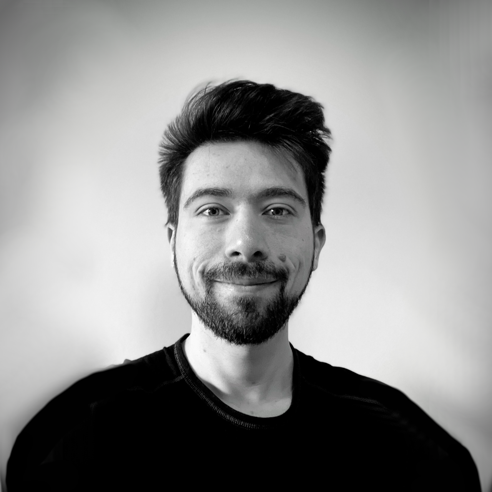

## About

 

This page is here to tell you a bit about me and what I do. 

You can also find [my CV](/cv) here!

#### <i class="fas fa-globe-europe"></i> Aside from Software

I like to spend my spare time reading, hiking, eating and occasionally managing to cook good food,
riding motorcycles and driving old cars and occasionally writing or speaking about things I care about. 

#### <i class="fas fa-people-group"></i> Supporting People as a Lead and a Developer

**I aim to have a positive impact**, on ...

<i class="fa-solid fa-lightbulb"></i> people figuring out what they want to achieve 
<i class="fa-solid fa-bullseye"></i> people achieving their goals 
<i class="fa-solid fa-seedling"></i> building environments enabling people to motivate themselves/supporting intrinsic motivation 
<i class="fa-solid fa-code"></i> building innovative software that helps people in some way 

#### <i class="fas fa-laptop-code"></i> Agile Software Development

Since taking part in adopting and figuring out Agile at a small startup, both general Agile principles and the practices of creating software that allows for being agile fascinate me.

Since 2021 I co-organize [Agile International Graz](https://www.meetup.com/agile-international-graz/) - an English-language Agile Meetup in Graz.

#### <i class="fas fa-graduation-cap"></i> Learning and Education

Sharing knowledge has been a common theme in my professional life, starting from my civilian service, through my studies to my work and personal projects. 
Recently this finds its main expression in writing articles to share my knowledge and volunteering as a referee and referee trainer for [RoboCup Junior](https://junior.robocup.org/) Austria, a yearly robotics competition for school children. 